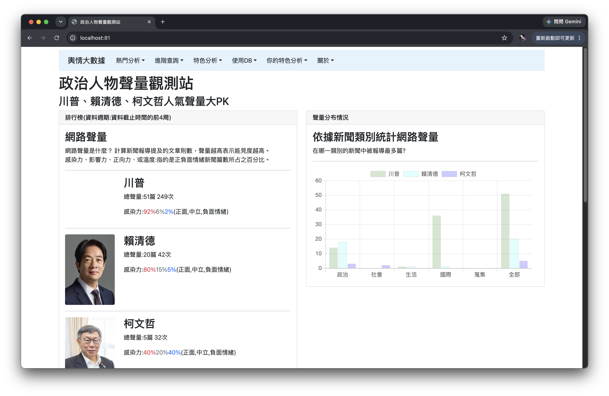
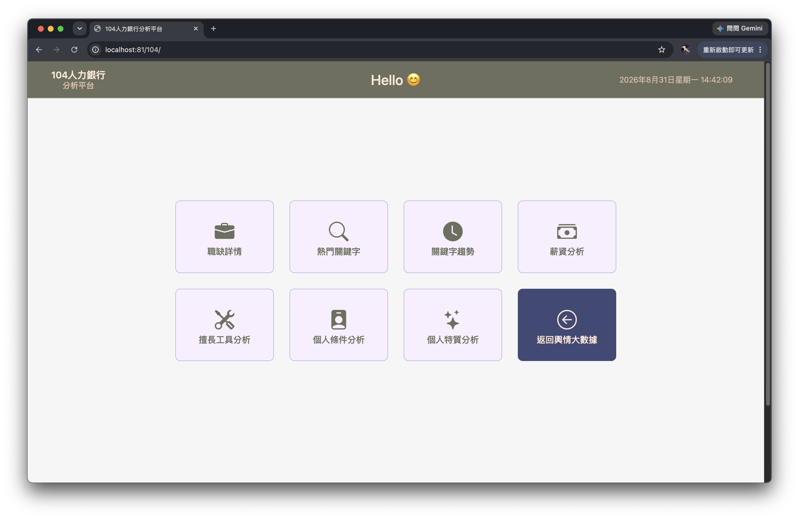
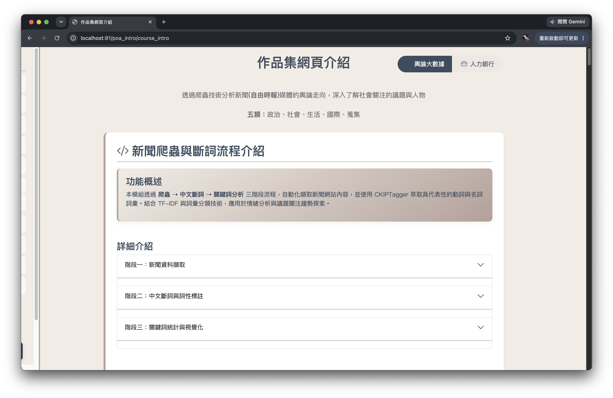

# 輿論大數據與 104 人力銀行分析平台

本專案使用 **Django、PostgreSQL、Nginx、Docker、Ollama** 建置，整合課堂中的輿論大數據分析、104 人力銀行職缺分析，以及個人作品集網站。

透過 Docker 可一次建立網站所需的執行環境，並由 Nginx 作為網站入口。

---

## 1. Docker 啟動方式

### 方法一：不啟動 Ollama

若只想瀏覽網站以及使用一般資料分析功能，可以不啟動 Ollama。

約需 **5 分鐘**，實際時間會依電腦效能與網路速度而有所不同。

```bash 
docker compose up --build nginx web-poa db
```

此模式可以使用大部分網站功能，但以下 AI 功能無法使用：

> **進階查詢 ->  自訂關鍵詞:呼叫語言模型產生分析報告 -> AI 產生分析報告不能用**

因為此功能需要 Ollama 語言模型。

---

### 方法二：啟動完整系統（包含 Ollama）

若需要使用 AI 分析報告功能，請啟動完整 Docker 環境。

第一次建置約需 **15 分鐘以上**，因為需要下載 Docker Image 與 Ollama 語言模型。

```bash
docker compose up --build
```

---

## 2. 開啟網站：

Docker 建置完成後，在瀏覽器輸入：

```text
http://localhost:81/
```


---
## 3. 課堂的分析：輿論大數據（新聞）
- 網址：http://localhost:81/
- 路徑：首頁



### 圖片來源與授權

網站中部分政治人物圖片取自 Wikimedia Commons：

- Donald Trump：Photo by Daniel Torok，Public Domain（U.S. Government Work）
- 賴清德：圖片來源為中華民國總統府，依政府網站資料開放宣告使用
- 柯文哲：圖片來源為中華民國總統府，依政府網站資料開放宣告使用

---
## 4. 自己的特色分析：104 人力銀行分析（職缺）
- 網址：http://localhost:81/104/
- 路徑：首頁 -> 你的特色分析 -> 104人力銀行分析
  > **104 人力銀行職缺分析網站**為自行設計與開發的特色分析功能，因此另外整理了完整的 Hackmd 筆記，可點擊前往：[☛☛☛☛☛☛☛](https://hackmd.io/@Xx0922/HkpB0-JLGg)




---

## 5. 作品集網頁
- 網址：http://localhost:81/poa_intro/course_intro
- 路徑：首頁 -> 關於 -> 網頁app介紹
  > 網站內另外建立個人作品集介紹頁面，用來展示相關專案與網站功能。




---

## 6. 系統架構

本專案使用 Docker  管理多個服務：

```text
Browser
   │
   │ http://localhost:81
   ▼
 Nginx
   │
   ├── Django Web
   │
   ├── PostgreSQL
   │
   └── Ollama
           │
           └── Local LLM
```

---

## 7. Docker 服務

Docker  主要包含以下服務：

| Service | 說明 |
| --- | --- |
| `web-poa` | Django 主要網站 |
| `web-llm` | LLM 相關 Web Service |
| `db` | PostgreSQL 資料庫 |
| `ollama` | 本地端大型語言模型 |
| `nginx` | 網站入口與反向代理 |

Nginx 對外使用：

```text
localhost:81
```

並將請求轉送至 Docker 內部對應的 Web Service。

---
